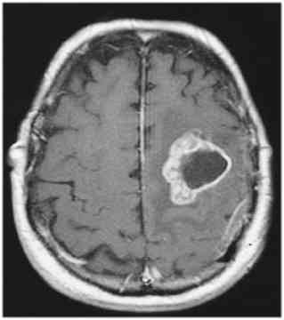

# Brain Tumors Detection

In this project a deep learning model based on a convolutional neural network (CNN) built to detect brain tumors from MRI images.

There are two pre-trained models in this repo :
1. Binary Cross entropy :  `BrainTumor10Epochs.h5`   
2. Categorical Cross Entropy : `BrainTumorCategorical10Epochs.h5`

## Dataset 
- Br35H : Brain Tumor Detection 2020
    * [Brain Tumor Detection Download Link](https://www.kaggle.com/datasets/ahmedhamada0/brain-tumor-detection)

A python flask app of project is available [here.](https://tumordetect.pythonanywhere.com/)